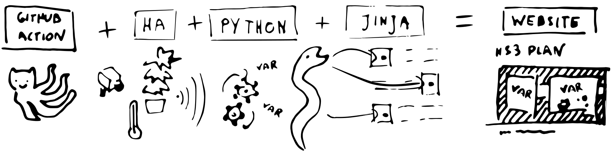

# Home Assistant HS3 Plan

Prepares a static website with the current state of [Hackerspace Trojmiasto](https://hs3.pl/) Home Assistant using its RESTful API.

You can see the live website here:
https://martasien.github.io/home-assistant-hs3-plan/

## Very scientific website generator architecture scheme

